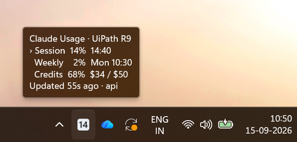
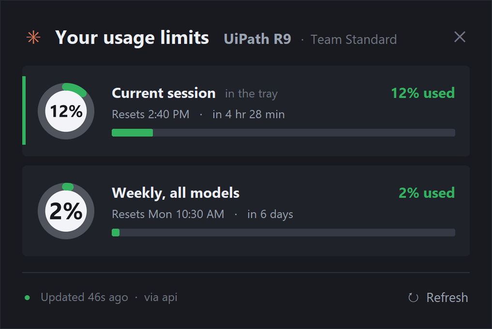

# clausage_bar

A Windows system-tray monitor for Claude usage. Your **current session**,
**weekly** window and **monthly credits** as a number in the tray, with alerts
at **50%, 75% and 100%** — so you never have to open Claude to check.

> **Unofficial, and not affiliated with Anthropic.** The figures come from the
> same endpoint Claude Code's own `/usage` calls, which is undocumented and
> unsupported. It can change or disappear without notice; when it does, this
> falls back to reading the Claude Code status line and
> [says so in the tooltip](#what-it-reads-and-how-honest-the-numbers-are)
> rather than showing a stale number as though it were current.



The badge is your **current session** percentage, as dark digits on a pale,
state-tinted tile: near-white under 50%, amber to 75%, red above. Hover for
all three windows; click for the panel.



It used to stack both numbers, and that was a mistake worth recording: a 16×16
tray icon gives each of two rows just 7px against `ENG / IN`'s ~8.7px, and
leaves nothing for the ~7px of leading that makes `ENG / IN` readable in the
first place. The result was too small to read. One number gets the whole 16px
and its glyphs measure ~11px, comfortably past `ENG / IN`. The other window is
one hover away, and the widget shows both at full size.

`CLAUSAGE_ICON_ROWS=2` brings the stacked layout back if you prefer it.

### Size: what is possible, measured

Windows hands a tray icon exactly `SM_CXSMICON` pixels — **16×16 at 100%
display scaling** — and no application can enlarge its own slot. Measured off a
real screenshot (upscaled 1.5×, so the tray icon reads 24px there):

| Surface | Real size | Glyph height per row |
|---|---|---|
| Tray icon | 16 × **16** px | ~7 px, 2px gutter |
| IME `ENG / IN` | 21 × **24** px | ~8.7 px, ~7px leading |
| **Floating widget** | 56 × **44** px | **~15 px**, 2px leading |

`ENG / IN` is not a tray icon — it is a taskbar button with 24px of height
where a tray icon gets 16. That gap cannot be closed from inside a tray icon,
so there are three answers, in increasing order of size:

1. **Fill the 16px slot** (done): glyphs edge to edge, color across the whole
   tile. Far more visible than small digits on a dark background, but 7px per
   row is the ceiling for two rows.
2. **Raise display scaling** — **Settings › System › Display › Scale**. At 150%
   the tray gives 24px and the badge switches to a 10px face, taller than
   `ENG / IN`. The badge reads `SM_CXSMICON` at render time and picks the
   largest face and integer scale that fits, so this needs no code change.
   (125% gives 20px, which still lands on the 7px face.)
3. **The floating widget** — the only way to beat `ENG / IN` at 100% scaling.

## One application, three surfaces

Complexity increases with the size of the surface, and all three share a
single palette and vocabulary from `theme.py`:

| Surface | Job | What it shows |
|---|---|---|
| **Tray ring** | instant signal | one arc coloured by state, with the number inside |
| **Tooltip** | quick summary | three aligned rows, resets, source |
| **Panel** | full dashboard | ring gauges, bars, reset times, refresh |

Before `theme.py` existed, each surface had invented its own palette and its
own bands: three levels in the panel, three slightly different colours in the
widget, a fourth set in the tray. `tests/test_theme.py` now fails if any
module reintroduces a `LEVEL_HEX` of its own.

### Why the panel looked blurry

The panel is a **separate process** and declared no DPI awareness. The tray
process declares per-monitor v2; the panel declared nothing. So on a 150%
display Windows told it the screen was 1280x720, Tk laid out a 452px window in
those coordinates, and the compositor stretched the result by 1.5 to fill
1920x1080. Every glyph and every rounded corner went through a bilinear
upscale.

| | Before | Now |
|---|---|---|
| Panel window | 452 x 401 logical, upscaled 1.5x | **678 x 599 real pixels** |
| Gauge bitmap | 52px, stretched into a 78px hole | 78px, drawn at size |
| Text | points, silently unscaled | pixels, scaled explicitly |

Declaring awareness fixes the sharpness but shrinks everything to two thirds,
so `Panel.px()` multiplies every dimension by the display scale and
`Panel.font()` sizes text in **pixels** rather than points. Points would have
gone through Tk's own idea of the display dpi, which on Windows is 96 whatever
the real value is — so they would have silently ignored the scaling.

That is the whole trade: Windows will either scale the pixels for you badly,
or hand you the real ones and expect you to do the arithmetic. This is the
third time the same class of bug has appeared in this project (the tray badge,
then the panel gauge, now the panel window), which is why the calculation is
now in one method per surface rather than sprinkled through the layout.

### Panel size across machines and monitors

The panel follows Windows display scaling, so the same build is 678 × 602 px
on a 150% screen and 452 × 401 px at 100% — intended to be the same *physical*
size. It stops looking that way when two machines have different pixel
densities relative to their scaling setting: a 1080p laptop left at 100% where
Windows would have recommended 125% gets a noticeably smaller panel.

```powershell
$env:CLAUSAGE_PANEL_SCALE = "1.25"     # this window only
```

A multiplier applied on top of the monitor's own scaling, so it stacks rather
than replaces. It exists because the alternative was telling someone to
rescale *every* application on their machine to enlarge one window. Measured:
452 × 401 → 565 × 501, exactly 1.25×.

It is clamped to 0.5–3.0. The panel draws its own title bar, so a window
whose close control lands off-screen cannot be dragged back — there is
nothing to drag it by. That makes `10` typed for `1.0` unrecoverable rather
than merely wrong, which is why the value is clamped instead of trusted.

#### Two multi-monitor bugs, fixed together

Declaring per-monitor awareness and then asking for the *system* DPI is a
contradiction, and the placement had the matching flaw:

| | Before | Now |
|---|---|---|
| Scale from | `GetDpiForSystem()` — the primary monitor, fixed at session start | the monitor under the cursor |
| Position from | `winfo_screenwidth/height` — the primary screen | that monitor's work area |
| Taskbar gap | a guessed 60 px | `rcWork`, whatever the real one is |

So docking a laptop to a differently-scaled monitor sized every dimension for
the wrong screen, and the panel opened bottom-right of the *primary* display
no matter which monitor the tray icon was clicked on. This was not
hypothetical: the development machine turned out to have a 100% secondary
beside a 150% primary, and had been hitting both bugs all along.

The cursor is the right thing to query — the panel only opens because someone
just clicked the tray icon, so the pointer is on the intended monitor, and
asking before any window exists means the answer arrives in time to lay out
with (`GetDpiForWindow` would not). Anything unexpected returns `(1.0, None)`
and reproduces the old single-screen behaviour rather than raising, since this
runs before there is a window to show an error in.

The remaining gap: dragging the panel between monitors mid-session does not
re-scale it. `WM_DPICHANGED` is not surfaced by Tk, and the panel is a
short-lived popup, so it is re-read on next open instead.

### The badge is the session, and only the session

It used to be whichever window was higher. The reasoning was that a calm badge
beside a nearly-spent weekly window would be a lie — but that traded one
ambiguity for a worse one: the number silently switched meaning between the
two windows, so a badge reading "33" could be either, with no way to tell
which from the taskbar.

A badge that always means the same thing is worth more than one that always
shows the larger number. It falls back to the weekly window only when there is
no session reading at all, since a blank badge is worse than the wrong one.

**The trade this accepts:** a nearly-spent *weekly* window no longer shows in
the taskbar. It is one hover away, it is marked in the panel, and it still
fires its own alerts at 50/75/100 — but the badge will not warn you about it.
`CLAUSAGE_ICON_STYLE=digits` restores the old worse-of-the-two behaviour if
that matters more than a stable meaning.

### No ring: the number is the badge

The ring read as a meter, which was the point, but it cost two thirds of the
slot's diameter:

| | Numeral height at 24px |
|---|---|
| Inside the ring | 9 px |
| No ring, 2px padding | **13 px** |

At tray size that difference is the whole legibility of the thing, and the
plate now carries what the arc used to: state lives in `theme.PLATE_TINTS`, a
pale wash from near-white through amber and orange to red. Every tint clears
12:1 against the ink, so the number never gets harder to read as the state
changes — only the mood shifts. A hairline a shade darker than the tint keeps
the badge's edge on a light taskbar, where the plate itself nearly vanishes.

The ring was demoted, not deleted: the panel still draws it, where there is
room for a ring *and* a number, and `CLAUSAGE_ICON_STYLE=ring` brings it back
to the tray.

**One detail worth keeping.** The numeral is sized against a two-digit
reference (`"88"`), not against the actual text. Fitting each string on its
own let a single digit fill the whole plate and then shrink by a third the
moment usage crossed 10 — the badge appeared to change size as the number
changed, which reads as a glitch rather than as data.

### The badge plate is bright, not dark

The first version put light digits on a dark disc. Both polarities are equally
legible *internally* — that was the wrong thing to measure:

| Ink against its own plate | Contrast |
|---|---|
| Dark ink on the bright plate (now) | 15.8 : 1 |
| Light ink on the dark plate (before) | 14.9 : 1 |

The difference is the **plate against the taskbar**, and there it is stark:

| Plate against the taskbar | Dark taskbar | Light taskbar |
|---|---|---|
| Bright plate (now) | **14.6 : 1** | 1.01 : 1 |
| Dark plate (before) | **1.06 : 1** | 15.3 : 1 |

A dark plate on a dark taskbar is 1.06:1 — invisible. The icon had no body at
all there; it read as a ring with digits floating inside it. A bright plate
gives it a solid silhouette on the dark taskbar that is the common case, and
on a light taskbar the plate vanishes instead — which is survivable, because
the coloured ring supplies the outline and the dark digits still read against
the light background.

Neither polarity wins outright. The bright one wins for a dark taskbar, which
is what this machine runs and what Windows 11 defaults to.

The ring also got thicker (`RING_STROKE_NUMBERED` 0.085 → 0.135) and the
margin went to zero, so the badge fills its 24px slot instead of floating in
it. The accents were re-picked to sit against white rather than black, and the
tray's calm band is now a slate blue rather than a neutral grey: against a
bright plate a neutral grey ring reads as an unfinished shape.

### The header names the team

`organizationName` from `~/.claude.json` — "Acme Corp" — rather than the plan
tier. On a team seat the limits belong to the organisation, so the team
answers "whose quota is this?" in a way that "Team Standard" never did. The
tier follows it, quieter, for the cases where the distinction matters. All
three surfaces read it from `Snapshot.account["org_name"]`.

### Hover is the native tooltip again

`CLAUSAGE_HOVER_CARD` now defaults to **0**. Hover is meant to be a glance,
and Windows' own tooltip is what a glance expects: it appears where the eye
already is, needs no window, and cannot end up behind anything.

The card is still here and still works — `CLAUSAGE_HOVER_CARD=1` brings it
back, and `hover.py` still solves the three genuinely hard problems documented
below. It turned out to be the wrong *surface* for the job rather than a bad
implementation of it.

### The hover card, and why the native tooltip had to go

`NOTIFYICONDATA.szTip` is 127 characters of plain text. No colour, no fonts,
no markup. However carefully that field is laid out it reads as console
output, because it *is* console output — there is no version of it that looks
like a product.

So the tooltip is now a **rendered card**: `card.py` draws it with Pillow
(dark surface, rounded corners, real type, real bars, the panel's palette) and
`hover.py` puts it on screen in a layered window when the cursor rests on the
tray icon. Three problems had to be solved, none of them obvious:

**Finding the icon.** `Shell_NotifyIconGetRect` needs the icon's identity —
owning window plus `uID` — and pystray exposes neither. Its `_message()`
builds a `NOTIFYICONDATAW` with `hID=id(self)`, and there is no `hID` field:
ctypes accepts the unknown keyword as an ordinary Python attribute and drops
it, so **the real `uID` is 0**. Verified by constructing the struct and
reading `uID` back. A latent pystray bug, but a stable one, and it is what
makes the card possible at all.

**Drawing something that is not a rectangle.** A normal window cannot have
rounded corners or a shadow; a layered one can. `UpdateLayeredWindow` takes a
32-bit bitmap with per-pixel alpha, **premultiplied** — that is what
`AC_SRC_ALPHA` means, and getting it wrong shows up as pale fringing around
every glyph rather than as an error.

**Not stealing input.** `WS_EX_TRANSPARENT` (hit-tests pass straight through),
`WS_EX_NOACTIVATE` and `WS_EX_TOOLWINDOW`, so the card can never take focus or
swallow a click meant for the icon. It is also placed *above* the icon, never
over it.

The native tooltip remains as the fallback and is only suppressed once the
card has proven it can locate the icon (`HoverWatcher.available()`). Trading a
working text tooltip for a card that can never appear would be strictly worse
than leaving it alone. `CLAUSAGE_HOVER_CARD=0` keeps the text tooltip.

The watcher polls at 90ms rather than waiting on events, because the icon's
mouse messages go to pystray's own window and it does not forward them. It
allows a few polls of grace before hiding: the cursor crosses the icon's edge
constantly on the way past, and a card that vanishes on the first pixel of
travel flickers.

### The tray numeral is set in a real typeface

The badge's number was hand-plotted from seven segments, which is what made it
read as a digital clock. Now that the numeral sits on a backing plate it can
be antialiased, so it is set in **Segoe UI Semibold** — measured to fit: at
13pt "90" inks 15x10, and the hole inside a 24px ring is exactly 15x10.

Semibold rather than Bold: Bold's stems start to close the counters in 8 and 9
once the downsample softens them.

### Which number the badge is showing

The badge shows **the higher of session and weekly** — a calm ring beside a
nearly-spent weekly window would be a lie. But a lone number in the taskbar
does not say *which* window it is, and the tooltip and panel used to list
three percentages and leave the reader to work it out.

So the rule lives in exactly one place, `icon.badge_window()`, and all three
surfaces read it:

| Surface | How it marks the badge's row |
|---|---|
| Tray | is the number |
| Tooltip | a `›` in its own column, so the percentages stay aligned |
| Panel | an accent strip down the card's left edge, plus a faint "in the tray" |

The strip alone was a riddle, which is why the words are there too.

### The state bands

Five display bands, deliberately **not** the notification thresholds:

| Usage | State | Panel / card | Tray |
|---|---|---|---|
| 0–49% | `calm` | green | **cool grey** |
| 50–74% | `moderate` | amber | amber |
| 75–89% | `warning` | orange | orange |
| 90–99% | `high` | red-orange | red-orange |
| 100%+ | `critical` | red | red |
| no reading | `unknown` | grey-blue | grey-blue |

The tray's calm band is the one deliberate divergence. In a dashboard "you
have room" is worth saying, so low usage is green. In the taskbar that same
green is a small bright dot competing for attention, and a usage monitor at
12% has nothing to say — so the ring stays cool grey until there is a reason
to colour it. (The brief asks for both: "0–49% neutral / cool gray" for the
tray in one section, "green represents healthy" for the panel in another.
This is how both are true at once.)

Alerts still fire at exactly 50/75/100 (`config.THRESHOLDS`) — a test asserts
the palette cannot move them. The eye just wants a finer gradation than three
steps: 76% and 95% were both "hot" under the old scheme.

Low usage is green rather than neutral grey, because "you have room" is itself
information and a grey ring at 5% looks broken rather than calm.

### The tray ring

A muted track with an arc swept clockwise from twelve o'clock. Rendered at 8×
and downsampled with Lanczos, with circles at both ends of the arc standing in
for the round caps Pillow's `arc()` does not provide.

It replaced two digits, which at 16–24px had to be packed so tightly that
"11", "II" and a pause bar were the same picture.

Candidates were rendered at true tray size — 16, 20 and 24px, on both a dark
and a light taskbar — before choosing:

| Candidate | Outcome |
|---|---|
| thicker ring | rejected: the hole closes at 16px and it reads as a filled dot |
| ring + centre dot | rejected: reads as a bullseye; the dot competes with the arc |
| three stacked bars | rejected: only three discrete levels; loses the continuous read |
| open gauge (270°) | rejected: the gap reads as a broken ring at 16px |
| **ring + numeral** | **shipped, after solving the contrast problem below** |

### The numeral inside the ring

The first pass shipped a bare ring, because a numeral inside one has no
background of its own: white ink over a *light* taskbar simply disappeared in
the render tests. But a ring alone answers "roughly how much" and never "how
much", which is the question the app exists to answer. Two changes made it
work:

**A backing plate.** The hole is filled with a near-opaque dark disc
(`RING_PLATE`). On a dark taskbar it is all but invisible and the digits look
like they float inside the ring; on a light one it reads as a deliberate dark
centre. Either way the ink has guaranteed contrast.

**A thinner ring when the numeral is present.** Every point of stroke costs
the hole *two* points of diameter, and the first attempt left digits 8px tall
in a 24px slot — technically legible, visibly cramped. Since the digits state
the value, the ring only has to hint at it, so it gets out of the way:

| | Stroke | Margin | Digits at 24px |
|---|---|---|---|
| Bare ring | 0.17 | 0.05 | — |
| With numeral | **0.085** | **0.02** | **10px tall** |

A bare ring keeps the bold stroke, because then it is the only signal there
is. 10px also clears the ~8.7px of the `ENG`/`IN` indicator next to it, which
is the yardstick this badge has been measured against all along.

**Below 20px the numeral is dropped** and the ring goes bare and bold: a 16px
hole yields 6px digits, which read as a smudge and make the ring look dirty.
`RING_MIN_GLYPH_PX` is the floor.

One glyph needed special care. Pure segments render `1` as a bare vertical
bar, so `100` came out as `IOO` — the identical trap the hand-plotted pixel
font fell into and was fixed for. The segment face now builds `1` with a flag
and a foot instead of from segments.

One geometry note worth keeping: Pillow grows an arc's width **inward** from
the bounding box, so the caps belong on the stroke's centre line, not on the
box — putting them on the box pushed them a half-stroke proud and turned every
partial ring into a sausage.

The ring and its plate are drawn supersampled and downsampled, because a curve
rendered at 24px directly is a staircase. The digits are then plotted at the
*final* size on top: they are axis-aligned rectangles, so supersampling them
would only soften edges that were already exact.

### The panel gauge

Same renderer as the tray badge, same stroke and margin ratios, same backing
plate — it is meant to read as one object at two sizes. It diverged at first,
with its own stroke ratio and no plate, and the two rings looked like
different components. `tests/test_icon.py::TestGaugeMatchesTheBadge` asserts
it cannot drift again: no gauge-specific geometry constants, the shared
`RING_*_NUMBERED` values, a plate behind the numeral, and the same clockwise
sweep from twelve o'clock.

The gauge differs only where it must: it can afford a real typeface and a "%"
sign, because it has four times the diameter to spend.

### The tooltip

`NOTIFYICONDATA.szTip` allows 127 usable characters, so the layout was chosen
by measuring against that cap:

| Layout | Cost |
|---|---|
| text only, with tier and resets | 118 chars |
| 10-cell meters, no resets | 105 chars |
| meters **and** resets | 120 chars |

Every option fit. The block meters were not dropped to save room — they were
dropped because a number and a clock time are what the eye wants from
something visible for two seconds, and 24 block glyphs beside them are noise.
The freed budget bought a title, the plan tier, the reset times and a source
line. Meters remain in `details()` (no cap, meant to be pasted into a bug
report) and in the panel, which draws real ones.

A trim ladder gives up detail in order of least value — plan tier, then
source, then credits, then the title — and never drops the two windows.

The priorities are **weights, not nested loops**. Nesting encodes the order in
the shape of the code, and it got it wrong: with the title as the innermost
loop, a tooltip one character over budget dropped the app's own name while
still spending fifteen characters on the plan tier. Each variant now carries
an explicit cost and the cheapest fitting one wins.

### Stale

Existing freshness thresholds and source selection are untouched. Only the
appearance changed: accents blend 70% toward a grey-blue, which keeps a hint
of the hue (a stale 95% still leans red) instead of the muddy olive a
hand-picked "desaturated amber" turned out to be. The panel mutes its labels
and its footer dot and says "Last read 47m ago · not current"; the tooltip,
having no colour at all, says "Last seen 47m ago · stale".

### Display scaling — read this before trusting any pixel measurement here

Windows gives a tray icon exactly `SM_CXSMICON` pixels: **16 at 100% display
scaling, 24 at 150%**. But a process that has not declared DPI awareness is
told 16 regardless, and Windows then stretches its 16px bitmap to the 24px the
tray actually uses.

That was happening on this machine. The display runs at 150%:

| | DPI-unaware (before) | DPI-aware (now) |
|---|---|---|
| Reported screen | 1280 × 720 | 1920 × 1080 |
| `SM_CXSMICON` | 16 | **24** |
| What the tray showed | a 16px badge upscaled 1.5× | a true 24px badge |

A 1.5× upscale of hand-plotted pixels is mush, and it silently undid the whole
point of drawing crisp glyphs. The entry point now calls
`SetProcessDpiAwarenessContext(PER_MONITOR_AWARE_V2)` before any window
exists — awareness cannot be changed once one has been created — and the badge
renders at whatever size it is really handed. `CLAUSAGE_DPI_AWARE=0` restores
the old behaviour.

Two earlier conclusions in this file were wrong because they were measured
against the virtualised 16px: that the slot could not be enlarged, and that two
stacked rows could never be legible. At a true 24px, two rows give 9px glyphs
against ENG/IN's 8.7px, so `CLAUSAGE_ICON_ROWS=2` is a real option here.

### The badge typeface

The digits are **composed from seven segments**, not set in a font. That was
not a stylistic choice — it followed from measuring the alternatives.

At a 16px inked height, every heavy TrueType face on Windows needs far more
width than the slot has, because each glyph carries side bearings:

| Face | Width of "48" at 16px tall |
|---|---|
| Arial Narrow Bold | 20 px |
| Impact | 21 px |
| Times New Roman Bold | 24 px |
| Arial Black | 30 px |
| **Segment-composed** | **12 px, at a 10px height with 2px strokes** |

So width, not height, is the binding constraint — and plotted glyphs have no
side bearings at all. They also let the stroke stay thick, which is what
actually makes a small numeral readable: below about 10px, weight beats size.
Digits are the same width by construction, so the badge never jitters as the
value changes.

Two details that came out of looking at the result rather than reasoning about
it: the stroke stops at 2px because the counter (the hole in `0` and `8`) is
what is left over — a 5-wide glyph keeps a 1px counter, which still reads, but
a 4-wide one would close it and the digit would go solid, so three digits fall
back to a 1px stroke. And seven segments cannot make a legible question mark,
so "no reading" is a single centred bar instead.

### Padding

The tile is full-bleed — it needs every pixel of the slot to read as a
deliberate chip rather than a stray square — so all the air comes from
insetting the digits: **3px above and below, 2px at the sides, 2px between
them**. The two axes are deliberately unequal. Vertical padding is free and is
what actually reads as breathing room; horizontal padding costs glyph width,
which is already the scarce resource, so 2px of it is paid for by dropping from
the 6-wide face to the 5-wide one at the same 2px stroke.

An earlier version used a symmetric 1px inset, which left 14px-tall numerals in
a 16px square touching the edge on every side. It looked congested however good
the glyphs themselves were. `TestBadgePadding` in `tests/test_icon.py` now
asserts the margins by measuring the ink's bounding box, so it cannot regress
again.

### Contrast

Measured, not assumed. WCAG AA wants **4.5:1** for small text:

| Pairing | Ratio |
|---|---|
| Dark ink on pale tint (`light`, default) | **15.6 : 1** |
| White on dark tile (`dark`) | 17.4 : 1 |
| Pale tile against a dark taskbar | 13.4 : 1 |
| White on the green band (`bands`) | **3.0 : 1** — fails AA |

That last row is why `light` is the default: the banded style that shipped
earlier put white text on a mid-green fill at 3.0:1, below the threshold. Dark
ink on a pale, level-tinted tile is the highest-contrast pairing available in a
16px square, and the bright tile itself stands out against the taskbar. There
are tests asserting every shipped pairing clears 4.5:1.

### Fonts

| Variable | Values | Default |
|---|---|---|
| `CLAUSAGE_ICON_FONT` | `serif` (Times New Roman) · `sans` (Segoe UI) · `pixel` | `serif` |
| `CLAUSAGE_ICON_STYLE` | `light` · `plain` · `dark` · `bands` | `light` |
| `CLAUSAGE_ICON_INK` | `white` · `level` | `white` |
| `CLAUSAGE_ICON_ROWS` | `1` · `2` | `1` |
| `CLAUSAGE_ICON_FONT_BOOST` | ± points on the fitted size | `0` |

TrueType faces are rendered through a **threshold**, not antialiased: a
half-lit pixel on a 7px-tall glyph reads as blur rather than smoothing. The
fitter measures the *inked* bounding box, since TrueType metrics include
ascender and descender leading that digits never use, and it drops the gutter
to 1px so a real face gets every row of band height available.

Two honest caveats about Times New Roman in a 16px tray icon:

- **It reads thinner, not bigger.** The band is 7px, which caps Times at 10pt;
  a serif face at that size loses its stroke weight, so it looks lighter than
  the hand-plotted pixel font even though the glyphs are nominally larger.
  `CLAUSAGE_ICON_FONT=pixel` goes back to the crisper blocky face.
- **`plain` drops the level color.** With no tile and white digits there is no
  band left to tint, so green/amber/red survives in the widget's accent bar,
  the tooltip and the panel. `CLAUSAGE_ICON_INK=level` tints the digits
  themselves; `CLAUSAGE_ICON_STYLE=bands` brings the colored bands back.
  Staleness shows in every style — where there is no fill to dim, the ink greys
  out instead.

### Why the background is transparent

`plain` is the default because **any tile colour we choose will differ slightly
from the taskbar's own**, and a 16×16 square of almost-right colour reads as a
visible box stuck to the bar rather than as part of it. Only alpha 0
disappears, which is exactly how `ENG / IN` is drawn — white text straight onto
the taskbar, no background at all.

Note that `ENG / IN`'s own typeface is **Segoe UI**, not a serif:
`CLAUSAGE_ICON_FONT=sans` matches it most closely, and `pixel` is the crispest
of the three at 16px.

A serif face has room to be itself in the **widget**, where the glyphs are
~17px rather than 7px. That is where Times New Roman actually looks right.

### The big floating widget

```
  ┌──────────┐
  │ ▌  48%   │   session
  │ ▌  17%   │   weekly
  └──────────┘
```

A borderless always-on-top window that parks at the bottom-right **just above
the taskbar**.

That placement is deliberate and was a bug at first: the widget originally sat
at `screen_height - height - 4`, which is inside the taskbar band — and since
the taskbar is itself always-on-top, the widget was drawn behind it and was
simply invisible however topmost it asked to be. It now measures the work area
with `SPI_GETWORKAREA` and stays clear of the bar. Not being bound by the 16px slot, it uses real Segoe UI Semibold with
proper leading — 56×44px by default, which is 1.8× `ENG / IN` and 2.75× the
tray icon's height. Times New Roman 13pt bold in white, with a colored accent
bar per row so the level still reads. `CLAUSAGE_WIDGET_FONT` and
`CLAUSAGE_WIDGET_FONT_SIZE` change the face and size.

```powershell
.\run_widget.pyw            # or: tray menu -> "Show big taskbar widget"
```

- **Left-click** opens the usage panel.
- **Drag** to move it; the position is remembered in `widget.json`.
- **Right-click** or **Escape** hides it.
- `CLAUSAGE_SHOW_WIDGET=1` makes the tray bring it up at startup, or drop a
  shortcut to `run_widget.pyw` in `shell:startup`.
- `CLAUSAGE_WIDGET_FONT_SIZE` (default 11) resizes it. 12 gives 56×46, which
  still fits the 48px taskbar; 10 gives 52×38 with more margin.

Click the icon for the full panel.

---

## What it reads, and how honest the numbers are

The percentages are **account-level**. Anthropic's unified rate limits cover
claude.ai on the web, the desktop app, and Claude Code together, so one reading
covers your usage everywhere — not just what you do in the terminal.

Two sources, with automatic failover:

| | Source | Fresh when | Cost |
|---|---|---|---|
| **Primary** | `GET api.anthropic.com/api/oauth/usage` | always, every 180s | one HTTP request |
| **Fallback** | the JSON Claude Code pipes to your status line | only while a Claude Code session is open | free |

Both were verified to return the same numbers and identical reset times.

### The endpoint is undocumented

This is the same data `/usage` shows inside Claude Code, and the endpoint is
what `/usage` itself calls — but Anthropic does not document or support it, and
can change or remove it without notice. Two practical consequences:

- **It is aggressively rate-limited** unless the request carries
  `User-Agent: claude-code/<version>`. With that header, 180-second polling is
  safe. This app never polls faster, backs off `180 → 360 → 720 → 1800s` on any
  429, and stretches to 15 minutes when your machine is idle.
- **The access token expires about every 60 minutes**, and it is normally
  Claude Code that refreshes it.

If the endpoint breaks, the tray falls back to the status line and says so in
the tooltip. It degrades to "fresh whenever Claude Code is open" rather than
dying.

### How your token is handled

The app reads `~/.claude/.credentials.json`, which Claude Code already
maintains, and uses the access token **only** in an `Authorization` header to
`api.anthropic.com`. The token is never logged, never written to any state
file, and never included in diagnostic output — there is a test asserting this.

It **never runs the OAuth refresh itself.** Refresh tokens can be single-use,
and racing Claude Code's own refresh could sign you out of the CLI. Instead it
asks Claude Code to rotate its own token, at most once every 5 minutes, and
measures success by the token *actually changing* rather than by an exit code —
`claude auth status --json` was observed to exit 0 while leaving a live token
untouched, so trusting its exit code would report a refresh that never
happened. Rotation is detected with a SHA-256 fingerprint; the token itself is
never handled for this.

The ladder escalates only as far as it needs to:

| Step | Cost | When it runs |
|---|---|---|
| `claude auth status --json` | fast, read-only | always tried first |
| `claude update` | heavier (can also update the CLI) | only if the token did not change |

If neither rotates it, the tooltip says `token expired — open Claude Code once`
and the tray falls back to the status-line source rather than showing nothing.
Set `CLAUSAGE_REFRESH_COMMAND` to `auth-status`, `update` or `none` to pin or
disable this; the default is `auto`.

`~/.claude/remote-settings.json` contains an org OTLP bearer token. This app
has that file on an explicit deny-list and will raise rather than read it.

### When the number could be wrong

The one situation that would mislead you is a stale high reading whose window
has since rolled over. Two guards:

- **Staleness is visible.** Under 6 minutes old, the badge is full color. From
  6 minutes to 12 hours it dims and the tooltip is prefixed `[STALE]` with
  `upd 47m ago`. Past 12 hours it becomes a grey `?`.
- **Resets are inferred.** If a window's `resets_at` has passed, the effective
  usage is 0% regardless of how old the reading is, and the tooltip says
  `5h 0% (reset)`. `resets_at` is authoritative about *when*, so this is sound
  rather than a guess.

---

## Install

Requires Python 3.10+ and Node (already present if you use Claude Code).

```powershell
.\install\preflight.ps1     # check this machine, change nothing
.\install\install.ps1
```

`install.ps1` runs the preflight itself and stops before touching anything if
it finds a blocker, so the separate call is only for looking first.

That creates a virtualenv, installs four dependencies, verifies the endpoint,
installs the status-line collector, registers the toast identity, and adds a
Startup shortcut. It is idempotent, backs up `statusline.js` before touching
it, and refuses to patch twice.

Flags: `-NoAutostart`, `-NoStatusline`, `-NoToastIdentity`, `-NoPin`,
`-ReplaceStatusline` (also rewrites the 5h/weekly bars to use real data —
already applied on this machine; see `install/statusline_patch.md`).

### Making the icon visible on the taskbar

Windows 11 puts every newly registered tray icon into the hidden overflow
flyout — the `^` chevron — so a brand-new icon is easy to miss. `install.ps1`
promotes ours automatically. To do it on its own:

```powershell
.\install\pin_to_taskbar.ps1              # always visible
.\install\pin_to_taskbar.ps1 -Unpin       # back into the overflow
```

Then quit and restart the tray, so the icon re-registers and Windows re-reads
the setting. The equivalent by hand is **Settings > Personalization > Taskbar >
Other system tray icons**, or simply drag the icon out of the flyout onto the
taskbar.

Visibility lives in the registry at
`HKCU\Control Panel\NotifyIconSettings\<id>` as the DWORD `IsPromoted`
(`1` = always visible). Windows creates that entry only after an icon has
registered once, so the tray must have run before it can be promoted.

One wrinkle worth knowing: the entry's `ExecutablePath` is the **base**
interpreter, not the venv's. A venv `pythonw.exe` is a small redirector that
re-executes the base interpreter, and Windows records the process that actually
owns the icon — which is also why you see two `pythonw.exe` processes. Matching
on path alone would therefore catch unrelated Python tray apps, so the script
also requires our tooltip signature.

```powershell
.\install\uninstall.ps1              # restores statusline.js from the backup
.\install\uninstall.ps1 -PurgeState  # also deletes snapshots, logs, notif state
```

### The standalone build (no Python on the target machine)

```powershell
.\install\build_exe.ps1 -OneFile   # one clausage_bar.exe, nothing beside it
.\install\build_exe.ps1            # a folder; starts ~2s faster
```

Writes `clausage_bar-standalone-<date>.zip` (~21 MB) beside the project. The
recipient unzips it and double-clicks **`Start clausage_bar.cmd`**. Nothing
installs; the folder carries its own CPython, Tcl/Tk and all four
dependencies.

This exists because the source package's hardest prerequisite turned out to be
the wrong bet. Preflight on a real recipient machine reported Claude Code
signed in, Node present, the API reachable — and `No usable Python 3.10+`.
Asking someone to install Python to see a number in their tray is a poor
trade, and the blocker was the only one of the six that a build could remove.

| | Source zip | Standalone zip |
|---|---|---|
| Size | ~175 KB | ~21 MB |
| Needs Python | **yes, 3.10+** | no |
| Needs Claude Code signed in | yes | yes |
| Status-line fallback | yes, with Node | only if they have Node |
| Patches `statusline.js` | optionally | no |
| Tests included | yes | no |

**Both modes, and the cost of onefile is small.** `-OneFile` produces a single
`clausage_bar.exe` with nothing beside it; the default produces a folder.

I initially argued against onefile on startup cost. Measured, that was
overstated — three runs of a full `--once` cycle each, taking the minimum to
discount network variance:

| | onedir | onefile |
|---|---|---|
| Files to hand over | a 21 MB folder | **one 20 MB file** |
| `--once` cycle (incl. one live poll) | 3.1 s | 5.3 s |
| **Unpack overhead** | — | **~2.3 s per launch** |
| Panel window opens in | ~1 s | 2.9 s |

A onefile exe unpacks its whole contents to a temp directory on every launch,
which is where that 2.3 s goes. For a tray app launched once per logon it is
paid once and is not worth arguing about; the honest caveats are that each
panel window pays it again, and that a self-extracting exe draws more
antivirus attention than a plain folder.

My first estimate of this gap was ~11 s, from single un-repeated samples that
were mostly cold file-cache noise. Worth recording as a reminder that one
timing run is not a measurement.

**Built in its own venv** (`.venv-build`). PyInstaller bundles whatever it
finds in the environment it runs in, so building from the dev venv would sweep
pytest, responses and their dependencies into the shipped package.

#### Three things that only break once frozen

All three fail *silently* — no console, no error, no icon — which is why each
is now pinned by a test in `TestFrozenBuild` and `TestFrozenSurfaceRouting`.
`config.FROZEN` is checked explicitly rather than inferred per site.

| Assumption | Why it breaks | Fix |
|---|---|---|
| `pythonw -m clausage_bar.panel` opens the panel | `sys.executable` is the app, not an interpreter; it takes no `-m`. Clicking the icon did nothing at all | `--panel` / `--widget` flags, so one exe answers as any surface |
| `exe -c "import pystray"` probes the autostart target | Same: no `-c`. The probe read the rejected flag as a *missing dependency* and refused to enable autostart — on the one build where the dependencies are guaranteed present | probe skipped when frozen |
| The shortcut points at `run_tray.pyw` | That file is not in the bundle. The shortcut would be written, look correct in Explorer, and do nothing at every logon | target the exe itself, no arguments |

`--hidden-import pystray._win32` is passed explicitly: pystray picks its
backend by building a module name at runtime, which static analysis cannot
see. Without it the exe builds cleanly and then fails at launch with "no
available backend" — the single most likely way this build breaks.

The build script smoke-tests the executable it just produced (`--once
--diagnose`, asserting a badge line appears), because a windowed exe with a
broken import shows the user nothing whatsoever.

#### Verifying a build beside a running install

`CLAUSAGE_INSTANCE=<name>` suffixes the single-instance mutex. Without it the
frozen tray correctly detected the already-running dev tray and exited, so the
only way to test a new build was to kill the working one first — and "kill the
thing that works, then check the new thing" is a bad verification story.

### Giving it to someone else (source zip)

```powershell
.\install\package.ps1
```

Writes `clausage_bar-<date>.zip` beside the project (~160 KB). The recipient
unzips it and double-clicks **`Install.cmd`**.

`Install.cmd` exists because a `.ps1` cannot be double-clicked: Explorer opens
it in Notepad, and the default `RemoteSigned` policy blocks a script that
arrived from a zip or a network share — which is exactly how this folder
travels. The `.cmd` sets `Bypass` for its own child process only and changes
nothing about the machine.

**What the recipient needs, and the part that surprises people.** This app has
no login of its own, by design — it reads the OAuth token Claude Code already
stores and never sees a password. So they need **Claude Code CLI installed and
signed in** (`claude`, then `/login`). Claude *Desktop* alone is not enough,
however signed-in it looks: Desktop keeps its credentials in the Windows
credential store, not in the file this app reads. Preflight says so in those
words rather than failing with a missing-file error.

The three blockers and the three soft failures, kept deliberately separate:

| Preflight finds | Result |
|---|---|
| Not Windows | blocks — the tray, toasts and DPI calls are all Win32 |
| No Python 3.10+ | blocks — with a note about the Store's alias stub |
| Not signed in to Claude Code | blocks — with the Desktop-is-not-enough note |
| No `claude` on PATH | warns — the token then goes stale within the hour |
| No Node | warns — you lose the fallback source, not the app |
| `api.anthropic.com` unreachable | warns — falls back to the status line |

An unauthenticated **429** from that last check counts as *reachable*: it is
the endpoint's documented reflex to a request with no `User-Agent`, so it
proves the network is fine. Reading it as a failure told the first version of
this check that a working machine was broken. The probe now sends the real
User-Agent anyway, so asking the question costs nothing against the limiter.

**What the zip deliberately does not contain.** `.venv` is excluded because it
is not portable at all — a venv hardcodes absolute interpreter paths in
`pyvenv.cfg` and in every `Scripts/*.exe` shim, so a copied one points at a
Python that does not exist on the target and fails in a way that looks like a
broken app. `install.ps1` rebuilds it in seconds. Also dropped: `__pycache__`
(bytecode stamped with the source path), the runtime state directory (shipping
a `snapshot.json` would show the recipient *your* usage numbers on first
launch), and every log.

`.credentials.json` and `.claude.json` are not in the project folder and could
not be picked up by accident. They are named in the exclusion list anyway,
because a list like that is also a statement of intent for whoever edits the
script next. On top of the name matching, the packager greps the staged copy
for token-shaped strings and refuses to build if it finds one — that is the
case the name list cannot catch, a real token pasted into a comment or a
fixture. It also strips the host and username out of the frozen-requirements
header, keeping the pins.

`tests/test_packaging.py` asserts each of those exclusions is still listed.
Those are text assertions over PowerShell, which cannot prove the packager
works — but the failure they guard is silent. A dropped line in `$dropFiles`
yields a zip that installs perfectly and happens to carry an OAuth token, and
no "does it install?" test would notice.

### Running it

```powershell
.\run_tray.pyw                    # no console (what the Startup shortcut uses)
.\run_clausage.cmd                # with a console, for logs
.\run_clausage.cmd --diagnose     # print everything and exit
```

Only one instance runs at a time, enforced with a named mutex.

---

## Your status line

Installing patches `~/.claude/statusline.js` in two ways.

**A two-line tap** feeds the tray, wrapped so it can never break your status
line:

```js
try { require('./clausage_collector.js').capture(data); } catch (_) {}
```

**The 5h and weekly bars now use real data.** They previously did not:

| Before | Problem |
|---|---|
| 5h bar = elapsed wall-clock time | measured time passing, not usage |
| weekly bar vs `WEEKLY_LIMIT = 1_000_000` | a hardcoded guess; unified limits aren't token budgets |
| `.weekly_usage.json` stored peak context size | not cumulative usage, and not a quota reading |

Now both read `rate_limits` from the payload Claude Code already supplies. Your
bar layout, colors and model shortening are unchanged. If `rate_limits` is ever
absent, the status line prints `usage:n/a` rather than invent a number.

The original is preserved at `statusline.js.clausage-bak` and restored by the
uninstaller. `.session_start` and `.weekly_usage.json` are no longer used and
can be deleted.

---

## Tray menu

| Item | Does |
|---|---|
| Show usage panel | The visual panel. Also the left-click action. |
| Show big taskbar widget | The floating indicator, for when 16px is too small. |
| Refresh now | Polls immediately. Will not override an active 429 backoff. |
| Copy details | Puts the full plain-text breakdown on the clipboard. |
| Open usage page | Opens claude.ai/settings/usage. (`/usage` is interactive-only, so no menu item can invoke it.) |
| Reset notification state | Re-arms all thresholds for the current period. |
| Start with Windows | Toggles the Startup shortcut. |

### Start with Windows

This is **on**. The tray menu's *Start with Windows* item is checked, and there
is a shortcut at:

```
%APPDATA%\Microsoft\Windows\Start Menu\Programs\Startup\clausage_bar.lnk
```

It targets the **venv's** `pythonw.exe` — not the base interpreter — with
`run_tray.pyw` as its argument and `WindowStyle=7` (minimised), so nothing
flashes at logon. `run_tray.pyw` puts `src/` on `sys.path` itself, so the
shortcut needs no `PYTHONPATH`.

`enable()` probes the interpreter with `import pystray, PIL.Image` before
writing the shortcut, and refuses if that fails. The reason is the shape of the
failure: an autostart entry pointing at an interpreter without the dependencies
produces no window and no error — just no tray icon, at every logon, until
someone thinks to look. The base interpreter beside the venv genuinely lacks
`pystray`, so this is reachable, not theoretical. Better a log line now than a
mystery in a month.

To check it, or turn it off:

- **Task Manager → Startup apps** lists it as `clausage_bar`; the toggle there
  wins over ours, and Windows records that in
  `HKCU\...\Explorer\StartupApproved\StartupFolder`.
- **`shell:startup`** in Explorer shows the shortcut; deleting it is equivalent
  to unchecking the menu item.

One fragility to know about: the shortcut stores absolute paths. **Moving or
renaming the project folder breaks autostart silently** — re-toggle *Start with
Windows* after any move.

### The two surfaces, and why there are two

A tray tooltip is plain text in a fixed 128-character field — no colors, no
fonts, no graphics, ever. So the tooltip is tuned as far as plain text goes:
aligned columns, a mini bar built from block characters, and rows dropped from
the end (credits first, then the age line) when the budget runs out. Both
windows are never dropped.

Everything visual lives in the **panel**, which opens on a left-click and is
laid out like Claude's own usage view: real progress bars, reset times in
words ("Resets 1:19 AM · in 4 hr 24 min"), usage credits, and a refresh
control. It runs as its own process, because Tk requires every call to happen
on the thread that created the interpreter and pystray does not guarantee
which thread runs a menu callback — this way a panel crash cannot take the
tray down. Its Refresh button drops a `refresh.request` file that the tray's
poll loop picks up, then waits for a newer snapshot before redrawing.

The icon is drawn natively at the tray's real pixel size with a hand-plotted
pixel font, not downscaled from a large TrueType render: at 16×16 two rows of
downscaled vector digits turn to mush, while plotted pixels stay sharp. The
primary face is 5×7 with heavy stems; `1` is only 4 wide, which is exactly what
lets `100` fit inside 16px, and it carries a top flag and a foot serif — without
them it reads as a lowercase L and `100` looks like `IOO`. A 3×5 fallback face
covers icon sizes too small for the primary one.

## Notifications

Each threshold fires **once per rate-limit period**, per window. The period is
keyed on `resets_at`, so a new window re-arms automatically with no timers.

- A jump past several thresholds sends **one** toast naming them:
  `Session usage 82% — Passed 50% and 75%. Resets 19:00 (in 3h05m). Weekly at 8%.`
- Every toast names the other window too, since that context is the whole point
  of not opening Claude.
- A dip inside a period never re-arms, so jitter around 50.0 can't double-toast.
### Usage credits

The third tracked number, and the only one denominated in real money. The
endpoint carries its own description of it:

> "Usage credits cover you when you hit your plan limits."

They are **not** consumed by ordinary use. Credits are drawn only once a
rate-limit window is exhausted: at that point, instead of being blocked until
the window resets, work continues and bills against the pool. So the pool is
what turns "stop until 15:50" into "keep going, at a cost".

The pool is monthly and independent of the 5-hour and 7-day resets. On a
team-managed seat `can_purchase_credits` and `can_toggle` come back `false` —
the cap is administered by the org, not by the user.

Credits get the same 50/75/100% alerts as the two windows. They previously
appeared in the panel and inside other toasts but never triggered one of their
own, so the cap could be reached in silence.

Their period has to be **inferred**, because the endpoint sends no `resets_at`
for the pool. Two signals are combined:

| Signal | Why it is needed |
|---|---|
| The calendar month (UTC) | A `monthly_limit` normally rolls at a month boundary |
| A fall of >10 points in used % | Direct evidence of a reset, whenever it happens |

The second exists because the first is a guess. An org whose billing month is
not the calendar month — a cap resetting on the 15th, say — would otherwise go
weeks without re-arming. A drop also catches a cap raised mid-month, which is
worth alerting on again. Either way `Reset notification state` re-arms it by
hand.

- On startup, a threshold already crossed in data older than 15 minutes is
  recorded silently rather than announced.
- State persists to `notif_state.json`, so a crash or Quit doesn't replay
  toasts.

Usage credits appear in the tooltip and Details but do **not** notify, since
you asked for session and weekly. To include them, add `spend` to
`PRIMARY_WINDOWS` in `model.py`.

---

## Files

```
src/clausage_bar/
  auth.py                credentials, expiry, refresh trigger — never logs the token
  provider_api.py        the endpoint: headers, 429 backoff, 401 retry, idle stretch
  provider_statusline.py reads state.json from the Node collector
  merge.py               source precedence + cross-source disagreement logging
  freshness.py           age classes and resets_at rollover inference
  thresholds.py          crossing state machine, persisted
  icon.py                two-row pixel-font badge at native tray size
  tooltip.py             ≤127-char tooltip, and the plain-text breakdown
  panel.py               the visual usage panel (its own process)
  widget.py              the big floating taskbar indicator (its own process)
  notifier.py            winotify → PowerShell → balloon fallbacks
  app.py                 tray, menu, poll loop
collector/
  clausage_collector.js  status-line tap; fails open by contract
tools/
  probe_endpoint.py      call the endpoint, print the response (token redacted)
  dump_probe.py          what the status line handed us, and what resolved
  fake_payload.py        pipe synthetic payloads through the real collector
```

State lives in `~/.claude/clausage/`: `snapshot.json` (last reading),
`notif_state.json`, `clausage.log` (rotating, 1 MB × 3), and up to three
one-time `raw/payload-*.json` dumps for schema confirmation.

Tunables are environment variables read by `config.py`: `CLAUSAGE_ICON_STYLE`
(`bands` | `dark`), `CLAUSAGE_POLL_S`,
`CLAUSAGE_IDLE_POLL_S`, `CLAUSAGE_FRESH_S`, `CLAUSAGE_DEAD_S`,
`CLAUSAGE_REFRESH_COMMAND` (`auto` | `auth-status` | `update` | `none`),
`CLAUSAGE_SHOW_WIDGET`, `CLAUSAGE_WIDGET_FONT`,
`CLAUSAGE_WIDGET_FONT_SIZE`, `CLAUSAGE_ICON_FONT`, `CLAUSAGE_ICON_STYLE`.

## Tests

```powershell
.venv\Scripts\python.exe -m pytest tests\ -q
```

217 tests, no network. They cover reset inference, threshold re-arming, the
tooltip length invariant, backoff escalation, User-Agent presence, both
timestamp formats, refresh-ladder escalation, badge rendering for every state,
and that the token never reaches a snapshot or a fingerprint.

---

## Troubleshooting

**Badge is a grey `?`** — no data. Run `.\run_clausage.cmd --diagnose`. If the
endpoint failed, the reason is in the output and in `clausage.log`.

**Persistent 429s** — almost always the User-Agent. Compare
`tools/probe_endpoint.py` against `tools/probe_endpoint.py --no-ua` to see the
difference. Do not lower `CLAUSAGE_POLL_S`.

**Badge stays dim** — nothing is refreshing. Either the endpoint is failing
(check the tooltip note) or Claude Code is closed and the token has expired.
Opening Claude Code once refreshes it.

**No status-line data** — `python tools/dump_probe.py` shows what the payload
contained and which key paths resolved. If the naming has drifted, the generic
scan names the field it found; add its path to `WINDOWS` in
`clausage_collector.js`.

**Toasts say "PowerShell"** — the AppUserModelId isn't registered. Re-run
`install.ps1` without `-NoToastIdentity`.

**Numbers disagree with `/usage`** — `clausage.log` records any cross-source
disagreement over 3 points. Worth reporting if you see it.

### Observed quirks

- The endpoint returns `resets_at` with **jittering sub-second precision** —
  the same window came back as `:00.353193`, `:00.543226` and `:00.577929` on
  three consecutive polls. Period keys are truncated to the minute; without
  that, every poll looks like a new window and re-arms every threshold.
- The endpoint sends `resets_at` as **ISO-8601**; the status line sends the
  **same instant as a Unix epoch in seconds**. Both are parsed.
- The endpoint carries rotating internal codename keys (`nimbus_quill`,
  `tangelo`, …) alongside the real windows. They're ignored by design.
